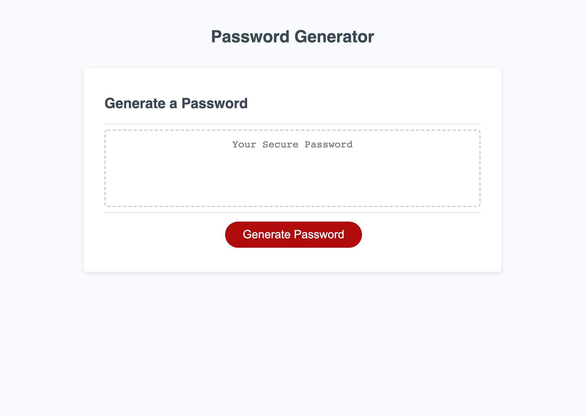

# password-generator

The following is a password generator that allows the user to create a unique password using window prompts after clicking the "Generate Password" button.

Prompts include:
* Password length from 8-128 characters
* Include lowercase characters
* Include uppercase characters
* Include numbers
* Include special characters

The application also includes error handling for the following:
* Incorrect password length
* No character type selected

## Deployment
[d-belleza.github.io/password-generator](https://d-belleza.github.io/password-generator)

